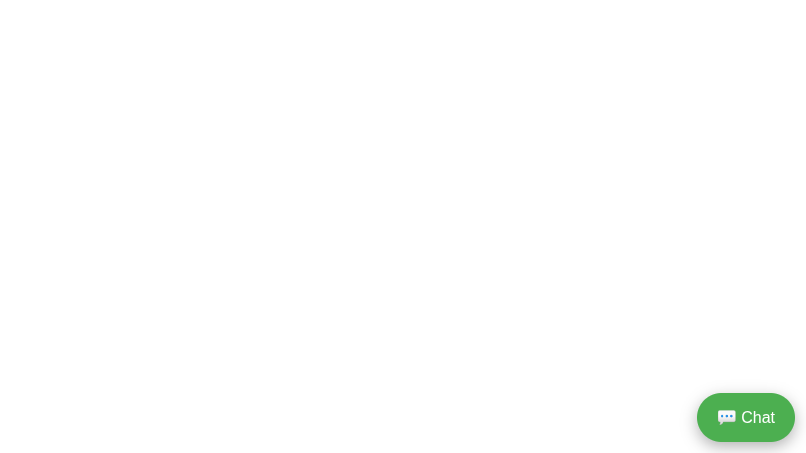

 ## Customer Support AI Chatbot

Created by: Josephine Mueni Nzioka
License: MIT License

## Project Overview

Customer Support AI Chatbot is a modern, fully customizable website chatbot designed to:

💬 Provide 24/7 automated customer support

📝 Capture leads with a built-in form (collects names & emails)

🎨 Deliver a professional, sleek interface with a floating chat button

⚡ Be easily branded with custom colors, headers, and welcome messages

This solution is perfect for small businesses, e-commerce stores, and service providers who want to automate customer support while capturing potential leads.

## ✨ Features

Floating chat button with smooth animations

AI-powered responses to common customer support questions (editable FAQ)

Built-in lead capture form integrated into the chat window

Branding customization: colors, fonts, headers

Quick installation and setup

Screenshots and demo video ready for Fiverr or GitHub showcase

## 📂 Folder Structure
customer-support-ai-chatbot/
│
├─ index.html         # Main HTML page
├─ style.css          # Styling for chatbot
├─ chatbot.js         # Chatbot logic and responses
├─ README.md          # Project documentation
├─ LICENSE.txt        # MIT License with author
├─ screenshots/       # Screenshots for Fiverr gallery
└─ demo_video/        # Demo video showing chatbot in action

## ⚙️ Installation & Usage

Upload Files
Copy the folder to your website or client’s server.

Preview Locally
Open index.html in a browser to test the AI chatbot.

Customize FAQ Responses
Open chatbot.js → edit the responses object for customer support questions.

Branding Customization
Open style.css → update colors, fonts, headers, or welcome messages.

Lead Capture Integration
Automatically collects names & emails.

Optional: integrate with Google Sheets, email API, or CRM systems.

🔗 Live Demo: [https://safnetco2.github.io/AI-Chatbot-Fancy-Delivery/](https://safnetco2.github.io/AI-Chatbot-Fancy-Delivery/)

## Screenshots & Demo Video 

Use /screenshots

## 📜 License

This project is licensed under the [MIT License](https://opensource.org/licenses/MIT). 
You are free to use, copy, modify, merge, publish, distribute, sublicense, or sell this project. 
See the LICENSE.txt file for full details

